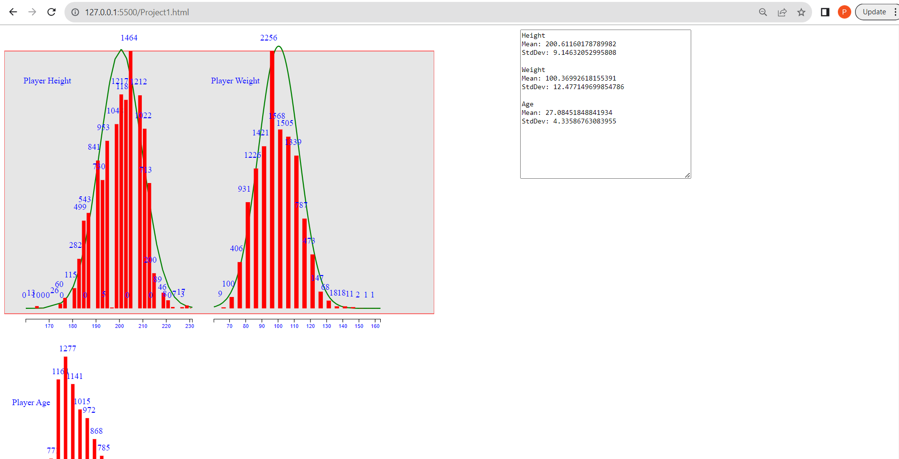

# NBA Player Attributes Analysis

## **Assignment Goals**
This project focuses on:
1. Displaying bar charts of attributes in a given dataset.
2. Understanding **Normal Distributions**.
3. Generating a **Normal Distribution** from uniform random samples.
4. Fitting a normal distribution to two dataset attributes.

---

## **Overview**
In this assignment, you will work with a dataset of NBA players (`player_data.csv`) to explore the height, weight, and age of the players. The project involves:
1. Generating histograms for player **height**, **weight**, and **age**.
2. Adapting reference code to generate a **normal distribution** using the **Box-Muller Transform**.
3. Fitting a normal distribution to the dataset's height and weight attributes and overlaying it on the histograms.
4. Calculating and displaying the **mean** and **standard deviation** of the resulting normal distribution.

### **References**
- [Box-Muller Transform](https://en.wikipedia.org/wiki/Box%E2%80%93Muller_transform)
- [Plotting Normal Distribution](https://matplotlib.org/stable/gallery/statistics/hist.html)
- [Binning Data with d3.bin()](https://github.com/d3/d3-array#bins)

---

## **Dataset**
- **Filename**: `player_data.csv`
- **Contents**: Player data including **height**, **weight**, and **age**.

---

## **Tasks**

### **1. Draw Bar Charts for Height, Weight, and Age**
- Read the CSV dataset and create bar charts for **player height**, **weight**, and **age**.
- Use `d3.js`'s **bin generation functions** to partition the data into a fixed number of bins.
- Display the histograms using fixed-width rectangles.
- Experiment with different numbers of bins to achieve a smooth, normal-looking distribution.

### **2. Labels, Annotations, and Axes**
- Ensure your bar charts include:
  - Informative **labels** for axes and titles.
  - **Annotations** to explain trends or observations.
  - Properly scaled **axes** for clear visualization.

### **3. Generate a Normal Distribution**
- Use the **Box-Muller Transform** to convert uniform random samples into normal distribution samples.
- Apply the normal distribution formula with a specified **mean** and **standard deviation** to calculate the probabilities for the generated samples.

### **4. Fit Normal Distribution to Data**
- Generate a normal distribution for a given **mean** and **standard deviation**.
- Overlay the resulting normal distribution on the **height** and **weight** bar charts.
- Adjust the parameters to find the best fit for the dataset.

---

## **Expected Output**
- A visualization similar to the one provided in `exp_output.png`.
- Each bar chart:
  - Should represent a specific attribute (height, weight, or age).
  - Must include an overlaid normal distribution for height and weight.

---

